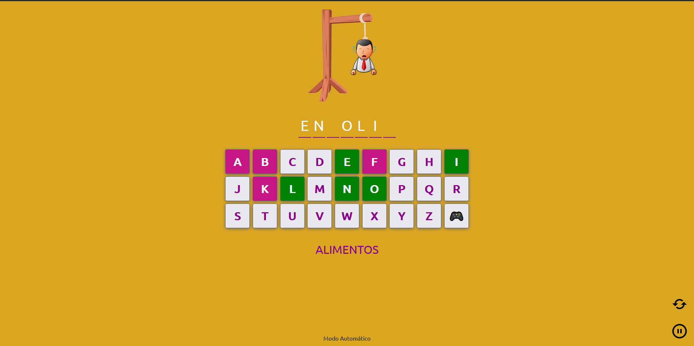
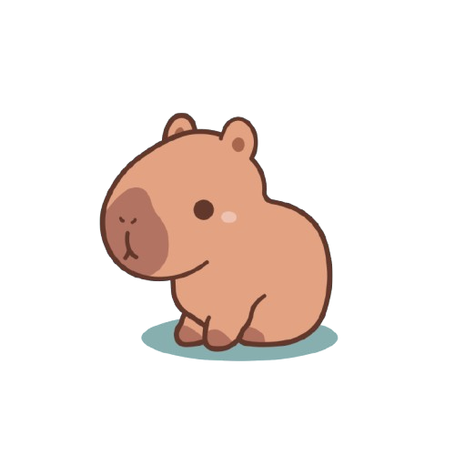

# Jogo da Forca 🎯🎮

Bem-vindo(a) ao repositório do **Jogo da Forca**! Este projeto foi desenvolvido como uma maneira divertida de praticar e consolidar meus conhecimentos em **HTML**, **CSS** e **JavaScript**. O jogo é simples, mas desafiador, e vai testar seu vocabulário e habilidades de adivinhação! 😄

## 🎯 Objetivos do Jogo

- **Adivinhar a palavra escondida**: Você terá um número limitado de tentativas para descobrir qual é a palavra antes que o personagem seja "enforcado".
- **Desafiar seu vocabulário**: Quanto mais palavras você acertar, melhor ficará no jogo!
- **Divertir-se**: Afinal, a ideia principal é praticar programação enquanto se diverte com um clássico jogo de adivinhação.

  

## 🚀 Tecnologias Utilizadas

- **HTML**: Estrutura do jogo.
- **CSS**: Estilização, cores e layout.
- **JavaScript**: Lógica do jogo, controle das tentativas e verificação das letras.

## 🎓 Propósito

Este projeto foi criado com o intuito de **praticar e melhorar minhas habilidades de programação**. A inspiração e base de código vieram de um tutorial incrível do canal **Agnaldo Guimarães** no YouTube, que compartilha diversos conteúdos educativos.

## 👏 Créditos

Agradecimentos especiais ao canal **Agnaldo Guimarães** por servir como inspiração e fornecer um excelente tutorial que ajudou a criar este jogo da forca.

## 🔗 Repositório

Confira o código completo do projeto [aqui no GitHub](https://ei-gih.github.io/JogoDaForca_JS/).

Contribuições são sempre bem-vindas! Sinta-se à vontade para explorar, sugerir melhorias ou até mesmo colaborar! 😊

  

